# Welcome to my GitHub profile! 👋

## About Me

Hello! I'm Ale Roses, a frontend developer in training passionate about creating incredible web applications. I'm constantly learning and exploring new technologies to improve my skills and knowledge. My goal is to become an expert in frontend development and contribute to exciting projects.

## Technologies

```mermaid
graph TB
    %% Add the following line to set the background color %%
    linkStyle default fill:#4f46e5, stroke:#4f46e5
    
    subgraph Project
    style Project fill:#090b10, stroke:#4f46e5
    HTML(HTML) --> CSS(CSS) --> JavaScript(JavaScript)
    JavaScript --> TypeScript(TypeScript)
    JavaScript --> React(React)
    end

    style HTML fill:#0C134F, stroke:#0C134F
    style CSS fill:#1D267D, stroke:#1D267D
    style JavaScript fill:#5C469C, stroke:#5C469C
    style TypeScript fill:#AD7BE9, stroke:#AD7BE9
    style React fill:#F266AB, stroke: #F266AB
```

## Contact

I'm excited to connect with other developers! If you have any questions, suggestions, or just want to chat, you can find me on ✨[LinkedIn](https://www.linkedin.com/in/ale-roses/). I'm open to collaborations and opportunities to continue growing as a frontend developer.

Thank you for visiting my GitHub profile! I hope you find something interesting here. See you soon!
